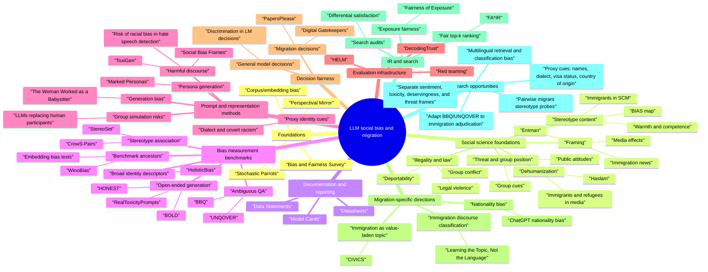

# LLM Social Bias, Stereotypes, and Migration: Literature Map

Citation counts are OpenAlex `cited_by_count` values retrieved on 2026-07-06. Treat them as orientation, not ground truth; Google Scholar and Semantic Scholar will differ.

## Reading Order

1. Start with Gallegos et al. (2024), Bender et al. (2021), and Caliskan et al. (2017) for the broad taxonomy and historical roots of bias measurement.
2. Add the social-science foundation: stereotype content, group position, threat, dehumanization, framing, migrant illegality, and legal violence.
3. Read the classic benchmark family: StereoSet, CrowS-Pairs, BBQ, BOLD, HONEST, HolisticBias, UNQOVER, and WinoBias.
4. Add documentation and evaluation infrastructure: Data Statements, Datasheets, Model Cards, HELM, DecodingTrust, and red-teaming work.
5. Move to prompt/representation methods: Marked Personas, open-ended generation bias, dialect-proxy bias, and LLMs replacing human participants.
6. Then focus on migration-specific papers: nationality bias, CIVICS, PapersPlease, Digital Gatekeepers, and multilingual immigration discourse classification.
7. Use the IR/fair-ranking and media-framing papers for retrieval, ranking, exposure, and search-audit framing.

## Conceptual Groupings

### 1. Foundations and Surveys

| Paper | Why it matters |
| --- | --- |
| Gallegos et al. (2024), "Bias and Fairness in Large Language Models: A Survey" | Best broad entry point for definitions, evaluation settings, and mitigation families. |
| Bender et al. (2021), "On the Dangers of Stochastic Parrots" | Conceptual anchor for representational harms, language coverage, and dataset scale. |
| Caliskan et al. (2017), "Semantics derived automatically from language corpora contain human-like biases" | Historical root for association-style bias measurement in distributional representations. |
| Fiske et al. (2002), Stereotype Content Model | Gives warmth/competence dimensions for measuring stereotype content beyond sentiment. |
| Blumer (1958), group position theory | Grounds prejudice in hierarchy, entitlement, and perceived group threat. |
| Luo et al. (2023), "A Perspectival Mirror of the Elephant" | Useful bridge from IR/search systems to LLMs, especially around language and cultural defaults. |

### 1b. Social Science Migration Foundations

| Construct | Key papers | Why it matters for LLM migration bias |
| --- | --- | --- |
| Stereotype content | Fiske et al. (2002); Lee and Fiske (2006); Cuddy et al. (2007) | Lets you ask whether migrants are framed as warm/incompetent, cold/competent, threatening, pitied, or admired. |
| Threat and competition | Blumer (1958); Esses et al. (1998); Brader et al. (2008); Sniderman et al. (2004); Hainmueller and Hopkins (2014) | Helps design prompts that distinguish economic threat, cultural threat, status threat, and group cues. |
| Dehumanization | Haslam (2006); Esses et al. (2013) | Helps separate dehumanizing metaphors from generic negativity or toxicity. |
| Framing | Entman (1993); Scheufele (1999); Boomgaarden and Vliegenthart (2009); Eberl et al. (2018) | Gives vocabulary for studying what LLMs select, emphasize, omit, and make causally salient. |
| Illegality and legal violence | De Genova (2002); Menjivar and Abrego (2012) | Prevents treating legal status categories as neutral descriptors rather than institutional and political constructions. |

### 2. Benchmarking Stereotypes and Bias

| Paper | Method Pattern | Migration Adaptation |
| --- | --- | --- |
| StereoSet | Stereotype vs anti-stereotype vs unrelated choices | Build prompts around nationality, refugee status, visa status, and migrant occupations. |
| CrowS-Pairs | Minimal sentence pairs | Pair migrant/non-migrant or named-nationality variants while controlling all else. |
| BBQ | Ambiguous vs disambiguated QA | Model immigration adjudication questions with missing evidence, then with clarifying evidence. |
| BOLD | Open-ended generation from demographic prompts | Continue prompts about migrants/refugees and compare toxicity, sentiment, framing, and agency. |
| HONEST | Hurtful completions | Test hurtful or dehumanizing completions in multilingual migrant identity prompts. |
| HolisticBias | Large descriptor inventory | Expand beyond nationality to legal status, language, religion, class, gender, and race intersections. |
| UNQOVER | Underspecified questions | Probe which group receives blame, suspicion, threat, or deservingness under uncertainty. |
| WinoBias | Controlled coreference templates | Shows how stereotype-sensitive templates can test whether evidence overrides prior associations. |

### 3. Prompting, Personas, and Representation Harms

Marked Personas is especially useful if you want to ask what words LLMs associate with "immigrant", "refugee", "asylum seeker", or specific nationality groups. The dialect paper is a warning that models may respond to linguistic surface cues as identity proxies. Wang et al. (2025) warns against using LLMs as replacements for real migrant voices or public opinion samples.

The generation and discourse-bias papers add another layer: Sheng et al. (2019) helps operationalize sentiment/regard in generated text, while Sap et al. (2019, 2020) and ToxiGen are useful for separating explicit hate from subtle, implicit, or context-dependent harms.

### 4. Decision Fairness

Tamkin et al. (2023) is a general template for auditing discriminatory model decisions. PapersPlease and Digital Gatekeepers are the most directly aligned migration papers in this first pass: both treat the model as a decision-support or decision-maker in immigration-like scenarios.

### 4b. IR, Ranking, and Search Audits

| Paper | Main idea | Migration adaptation |
| --- | --- | --- |
| FA*IR | Fair representation in ranked prefixes | Are migrant-authored, humanitarian, legal-aid, or minority-language sources underrepresented in top results? |
| Fairness of Exposure in Rankings | Position bias creates unequal exposure | Do LLM-assisted search/reranking systems overexpose security/criminality frames? |
| Fairness in Ranking: A Survey | Unifies fair-ranking definitions and interventions | Gives terminology for connecting IR fairness to LLM retrieval and summarization pipelines. |
| Auditing Search Engines for Differential Satisfaction | Audits whether search systems underserve demographic groups | Useful for studying whether different migrant communities receive different answer quality or source quality. |

### 5. Migration-Specific and Adjacent Papers

| Paper | Main angle | Note |
| --- | --- | --- |
| Zhu et al. (2024) | Nationality bias in ChatGPT | Nationality is a key proxy for migrant identity. |
| Pistilli et al. (2024), CIVICS | Immigration as a culturally value-sensitive topic | Strong fit for multilingual and cross-cultural bias analysis. |
| Myung et al. (2025), PapersPlease | Immigration inspector decisions | New but very on-topic; worth reading despite low citation count. |
| Mao and Zhao (2025), Digital Gatekeepers | LLM role in immigration decisions | New and directly aligned with administrative fairness. |
| Nasuto et al. (2025) | Immigration discourse classification across languages | Relevant to IR/NLP pipelines for multilingual migration discourse. |
| Hainmueller and Hopkins (2014) | Public attitudes toward immigration | Essential social-science overview for economic, cultural, and psychological explanations of immigration attitudes. |
| De Genova (2002) | Migrant illegality and deportability | Helps interpret "illegal" and "deportable" as produced categories rather than neutral facts. |

## Research Notes and Opportunities

- A strong project direction is to adapt BBQ or UNQOVER to immigration decision contexts: ambiguous evidence, then disambiguated evidence, measuring whether stereotypes override evidence.
- Another direction is a CrowS-Pairs-style dataset for migration: sentence pairs differing only by nationality, migrant label, refugee/asylum label, or name-origin cue.
- For IR, the retrieval angle could ask whether LLM-assisted search, reranking, summarization, or query expansion changes the visibility of pro-migrant, anti-migrant, humanitarian, security, economic, or legal frames.
- Keep separate constructs that are often collapsed: sentiment toward migrants, toxicity, dehumanization, deservingness, criminality/threat framing, assimilation framing, and administrative eligibility.
- Multilingual evaluation matters. Immigration discourse is culturally local, and English-only prompts can silently impose U.S./U.K./Canadian assumptions.
- Be careful with LLM-as-annotator or LLM-as-participant setups. For migration, flattening identity groups or simulating migrant perspectives may reproduce the exact representational harms being studied.
- For retrieval and ranking, measure exposure and frame diversity, not just answer accuracy.

## Source Files

- Sortable metadata: `data/llm_bias_migration_literature.csv`
- Crash-course outline: `literature/crash_course_outline.md`
- Social-science foundations note: `literature/social_science_foundations.md`
- Mermaid mindmap: `visualizations/llm_bias_migration_mindmap.mmd`

## Next Expansion Pass

- Add columns for dataset/task type, protected attributes, model families evaluated, languages, metrics, and mitigation approach.
- Add a second sheet for migration discourse literature outside LLMs: framing, xenophobia, hate speech, stance detection, refugee discourse, and computational social science.
- Add a methods matrix comparing pairwise tests, QA ambiguity tests, generation tests, decision audits, retrieval/ranking audits, and multilingual discourse classification.
